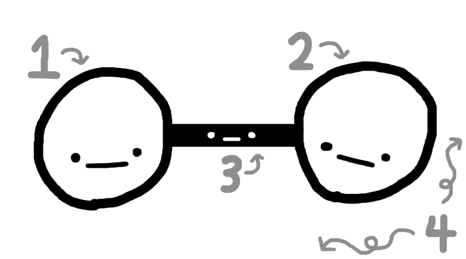

# La mémoire court terme est nulle

La psychologie cognitive nous apprend que notre mémoire court terme est nulle contrairement à notre mémoire long terme très puissante. Nous arrivons à retenir 4 (± 1) blocs d'information dans notre mémoire court terme.

___

## Références

- [Why we can't remember what we learn and what to do about it?](https://interactive.wharton.upenn.edu/learning-insights/why-we-cant-remember-what-we-learn-and-what-to-do-about-it)
- [What is short-term memory](https://www.verywellmind.com/what-is-short-term-memory-2795348)
- [Human brains are awesome, humans brains suck](https://vimeo.com/327793736)
